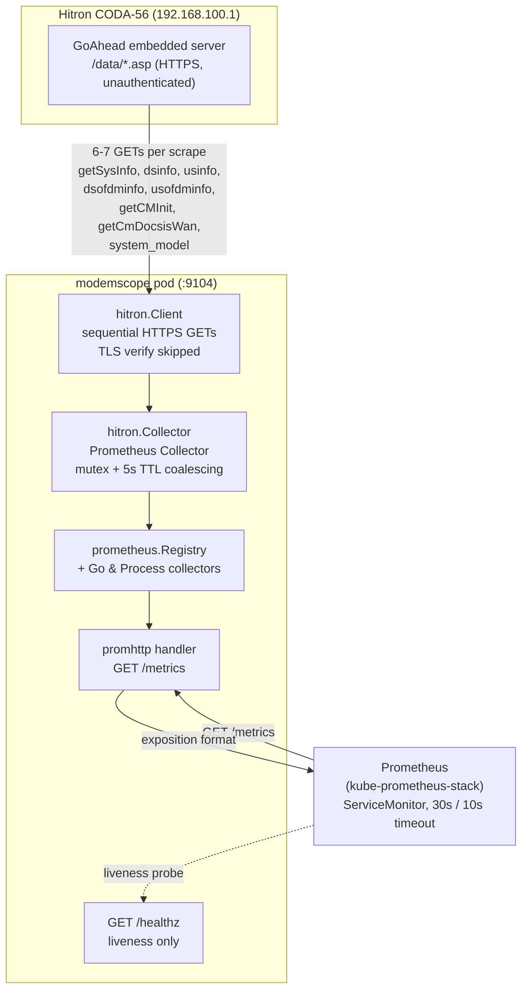

# Architecture

This document describes how modemscope is put together: the components, how a
Prometheus scrape flows end to end, the modem interface it depends on, and the
design decisions that shape it. For *what* the metrics mean and *how* to query
them, see [`README.md`](README.md).

## Purpose and context

modemscope is a Prometheus exporter for Hitron DOCSIS cable modems. It turns the
modem's own live-only status pages — per-channel SNR, transmit/receive power, FEC
error counters, and the DOCSIS registration state machine — into time series
Prometheus can retain, so an intermittent line problem leaves evidence behind
instead of vanishing the moment the modem reboots.

It is verified against a **Hitron CODA-56** (DOCSIS 3.1, sw `7.3.5.3.2b1`) on
Comcast, and runs as a single-replica Deployment in the homelab Kubernetes
cluster, scraped by kube-prometheus-stack, feeding a live dashboard and a set of
alerting rules.

The single most important series it emits is `modemscope_uptime_seconds`: every
error counter the modem reports resets on reboot, so "0 uncorrectables" is
meaningless unless you also know the modem has not just restarted. A silently
rebooting modem is invisible to ping and speed tests; uptime is the only signal
that distinguishes a clean line from one that just reset its own evidence.

## Component and data-flow overview



Data flows in one direction on each scrape: Prometheus hits `/metrics`, which
drives the collector, which pulls a fresh snapshot from the modem, which is
rendered back to Prometheus as exposition-format text. Nothing is polled on a
background timer — collection happens inline with the scrape (see below).

## Runtime flow, end to end

The entrypoint is [`cmd/agent/main.go`](cmd/agent/main.go). One process, one
HTTP server, no background pollers.

1. **Startup.** `run()` reads three environment variables (all optional):
   - `MODEMSCOPE_LISTEN_ADDR` — listen address, default **`:9104`**
   - `MODEMSCOPE_MODEM_URL` — modem base URL, default `https://192.168.100.1`
   - `MODEMSCOPE_TIMEOUT` — total modem-I/O budget per scrape, default `8s`

   The budget must stay below Prometheus's scrape timeout. If a slow-but-alive
   modem takes longer than the scrape timeout, Prometheus gives up before
   `modemscope_up=0` can be delivered — losing the "modem is sick" signal exactly
   when it matters. The default budget is `8s` against an assumed `10s` scrape
   timeout; `main.go` logs a warning if the configured budget is at or above the
   assumed `10s`.

2. **Registration.** A private `prometheus.NewRegistry()` (not the global
   default) is populated with three collectors: the standard `GoCollector` and
   `ProcessCollector`, plus `hitron.NewCollector(client, log, budget)`. Using a
   private registry keeps the exporter's surface to exactly these collectors — no
   accidental global metrics.

3. **Serving.** An `http.ServeMux` exposes two routes:
   - **`/metrics`** — `promhttp.HandlerFor(reg, …)` with `Timeout: budget + 1s`.
     No `MaxRequestsInFlight` limit: rejecting an overlapping scrape would 503,
     which Prometheus reads as the exporter being down. Overlap is instead
     handled by coalescing inside the collector.
   - **`/healthz`** — always returns 200. Liveness is deliberately "the exporter
     process is running," **not** "the modem is reachable." An unreachable modem
     is a metric worth alerting on (`modemscope_up 0`), not a reason for
     Kubernetes to restart the pod.

   The server runs with `ReadHeaderTimeout: 5s` and shuts down gracefully on
   SIGINT/SIGTERM with a 5s drain.

4. **Collect (per scrape).** When Prometheus GETs `/metrics`, promhttp calls
   `Collector.Collect` ([`internal/hitron/collector.go`](internal/hitron/collector.go)):
   - A `context.WithTimeout(ctx, budget)` bounds the modem I/O for this scrape.
   - `fetch(ctx)` reads the modem, coalescing concurrent scrapes (see below).
   - `modemscope_scrape_duration_seconds` is always emitted.
   - On error, **only** `modemscope_up 0` is emitted and Collect returns —
     nothing else, so stale channel values can never look live.
   - On success, `modemscope_up 1` plus the full metric set: `_info`, `_uptime_seconds`,
     per-channel downstream/upstream QAM series, DOCSIS 3.1 downstream OFDM and
     upstream OFDMA series, the `_docsis_init_state` state machine, and
     `_network_access`.

5. **Coalescing.** `fetch` holds a mutex and a 5s TTL cache
   (`lastAt`/`lastStatus`/`lastErr`). The TTL — not the mutex — does the
   coalescing: a second concurrent scrape (a second Prometheus replica, or a
   human `curl`) blocks on the lock, acquires it after the in-flight fetch
   completes, re-checks the TTL, and reuses the just-stored result instead of
   fanning out its own 6-7 requests at the fragile embedded modem server. The TTL
   (`5s`) is well under any sane scrape interval, so each real scrape still reads
   the modem afresh. **The TTL must stay `> 0`**: with `ttl=0` the mutex only
   serializes, and N concurrent scrapes still produce N full fetches.

6. **Metric emission.** `emit()` skips any value the firmware reports as a
   non-numeric placeholder (empty, `--`, `TODO`, `NaN`, `Inf`) rather than
   emitting a misleading `0`. A single `NaN`/`Inf` sample would poison `rate()`
   and `sum()` for an entire series, so absence is preferred over poison.

## The modem interface

modemscope talks to the modem over **HTTP(S), not SNMP.** The client
([`internal/hitron/client.go`](internal/hitron/client.go)) issues plain GETs to
the modem's unauthenticated JSON endpoints on its embedded GoAhead web server.

`Client.Fetch` reads the following `/data/*.asp` endpoints **sequentially** — the
modem runs a small embedded server that does not tolerate concurrency:

| Endpoint | Decoded into | Required? |
| --- | --- | --- |
| `/data/getSysInfo.asp` | `SysInfo` (uptime, hw/sw version, serial, RF MAC) | yes |
| `/data/dsinfo.asp` | `[]DSChannel` (downstream QAM channels) | yes |
| `/data/usinfo.asp` | `[]USChannel` (upstream QAM channels) | yes |
| `/data/dsofdminfo.asp` | `[]DSOFDMChannel` (DOCSIS 3.1 downstream OFDM) | tolerated |
| `/data/usofdminfo.asp` | `[]USOFDMChannel` (DOCSIS 3.1 upstream OFDMA) | tolerated |
| `/data/getCMInit.asp` | `CMInit` (DOCSIS registration state machine) | yes |
| `/data/getCmDocsisWan.asp` | `DocsisWan` (config name, CM IP) | yes |
| `/data/system_model.asp` | `Model` (model/vendor name) | best-effort |
| `/data/getLinkStatus.asp` | `LinkStatus` (LAN port link state, speed, duplex) | best-effort |

Interface characteristics baked into the client:

- **TLS verification is intentionally skipped** (`InsecureSkipVerify: true`). The
  modem presents a CableLabs-issued cert whose CN is its own MAC address, which
  cannot validate against a normal chain. The endpoints are unauthenticated,
  read-only, and on a link-local management subnet, so this is a status read, not
  a trust boundary that could be meaningfully enforced.
- **Response reads are capped** at 1 MiB (`io.LimitReader`) so a wedged modem
  streaming garbage cannot exhaust memory.
- **Two response shapes.** Most endpoints wrap a single object in a one-element
  array (`getOne[T]` unwraps them); `system_model.asp` returns a bare object
  (`Model`), decoded directly.
- **OFDM endpoints are tolerated, not required.** They are the newest and
  least-portable part of the surface. A read failure on either drops only the
  OFDM series (recorded in `Status.OFDMErr`) rather than failing the whole scrape
  — a firmware quirk on one endpoint must not blind uptime, QAM channels, and
  registration state behind `up=0`.
- **Placeholder tolerance.** Firmware emits `"NA"`, `""`, `"--"` for absent
  values; `parseFloat` rejects these and `NaN`/`Inf`. OFDM receiver locks are
  gated so a partially-locked receiver (`plc=1`, `ncp=0`/`mdc1=0`) is reported as
  such rather than as a clean carrier.
- **Uptime parsing** (`ParseUptime`) tolerates the Hitron `"00h:02m:57s"` format
  (with a speculative optional leading day field); an unparseable value yields an
  error so the metric is omitted rather than faked.

### Dependencies

The dependency surface is deliberately tiny (`go.mod`, Go 1.23):

- **`github.com/prometheus/client_golang` v1.20.5** — the only direct dependency:
  `prometheus` (registry, `Desc`, const metrics), `collectors` (Go/Process),
  `promhttp` (the `/metrics` handler).
- The standard library provides everything else: `net/http` + `crypto/tls` for
  the modem client, `encoding/json` for decoding, `log/slog` for structured logs,
  `regexp`/`strconv` for parsing.

There is no SNMP library, no web-scraping/HTML parser, and no configuration
framework — configuration is three environment variables.

## Key design decisions

- **Inline collection, not a background ticker.** The modem is polled during
  `Collect`, in lockstep with Prometheus, so the sample timestamp matches when
  the value was actually read. A scrape is ~200 ms, so there is no reason to
  decouple.
- **Coalesce, don't reject, overlapping scrapes.** A TTL cache + mutex protects
  the fragile modem from a request dogpile while still reporting the exporter as
  up. `MaxRequestsInFlight` would protect the modem but 503 the second caller,
  which Prometheus reads as "exporter down" — a worse lie than a few-seconds-old
  sample.
- **`up=0` is the only signal on failure.** On a failed scrape the collector
  emits `modemscope_up 0` and nothing else, so no stale per-channel value can
  masquerade as live.
- **Absence over misleading zero.** Non-numeric placeholders and `NaN`/`Inf` are
  dropped, never emitted as `0`, because a poisoned sample breaks `rate()`/`sum()`
  across an entire series.
- **Explicit `Describe`, not `DescribeByCollect`.** Descriptors are listed by
  hand so registration does not trigger a real modem fetch (which would block
  startup on I/O, seed the cache with a startup-time result, and invalidate
  concurrency tests).
- **Health decoupled from modem reachability.** `/healthz` reflects only the
  exporter process, so an ISP-side outage does not cause Kubernetes to restart
  the pod.
- **OFDM is best-effort.** The most fragile part of the modem's API can degrade
  without taking down the rest of the instrument.

## Deployment

- **Image:** built by the multi-stage [`Dockerfile`](Dockerfile) — `golang:1.23`
  builder producing a static `CGO_ENABLED=0` binary, `distroless/static-debian12`
  runtime, non-root `USER 65532:65532`, `EXPOSE 9104`. Published to
  **`ghcr.io/gjcourt/modemscope`** (see `Makefile` and `.github/workflows/build.yml`).
  CI tags images `:<branch>` and `:<sha7>` on push to `main`.
- **CI** (`.github/workflows/build.yml`): a `lint` job runs `gofmt -l`,
  `go vet`, `go test`, and a `go mod tidy` diff check; an `image` job builds and
  (on push) pushes to GHCR.
- **Homelab pin:** the Kubernetes manifests live under
  **`homelab/apps/base/modemscope/`** (in the separate `homelab` repo). It
  deploys as a **Deployment** (single replica — the modem is a single fragile
  target), fronted by a ClusterIP `Service` on port `9104` (named port
  `metrics`), scraped via a `ServiceMonitor` (`interval: 30s`,
  `scrapeTimeout: 10s`, forcing `job="modemscope"`). Alerts ship as a
  `PrometheusRule`, and a `NetworkPolicy` scopes egress to the modem. The image
  tag is pinned in that repo's `deployment.yaml` and rolled by Flux.

## Repository layout

```
cmd/agent/main.go              process entrypoint: config, registry, HTTP server
internal/hitron/client.go      modem HTTP client, JSON types, parsing helpers
internal/hitron/collector.go   prometheus.Collector: Describe/Collect + coalescing
internal/hitron/*_test.go      client and collector tests
Dockerfile                     multi-stage build → distroless image
Makefile                       build / push / test / tidy
.github/workflows/build.yml    lint + test + image CI
```

The `internal/` tree is intentionally flat — a single `hitron` package holds both
the modem client and the Prometheus collector. There is no `domain`/`adapters`
hexagonal split, so there is no architecture-guard (`go-arch-lint`) config: the
package boundary is enforced by Go's `internal/` visibility and by the small size
of the surface, not by a layered ruleset.
